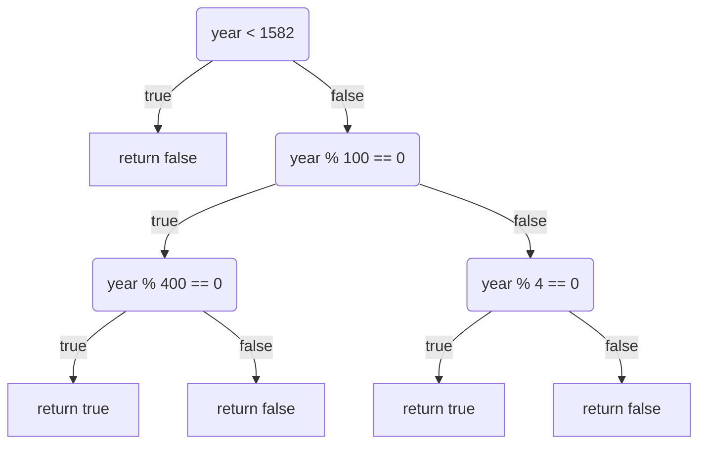

# Leap Year CLI

## IsLeapYear diagram

## IsLeapYear function

The function IsLeapYear receives an input as an integer. We call this input parameter "year".
First, we check if the input year is before or after leap years introduction in 1582 and if it
isn’t, we will return false.

Next, we will check if the input parameter is a centennial, that is: Is the year divisible by
100? If so, we must check if it is divisible by 400 and return true if it is and otherwise false.

If it is not a centennial year, then we instead check if the year is divisible by 4 and if so
return true and otherwise false.